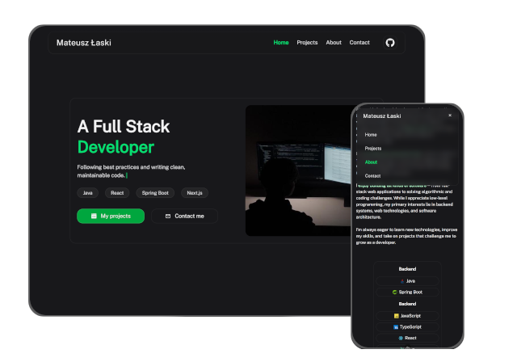

# Mateusz Łaski Portfolio

This repository contains the source code for my personal portfolio, which is available at:

🌐 **https://mateuszlaski.vercel.app**

The source code is publicly available for viewing and learning purposes only.

No permission is granted to copy, modify, redistribute, or use this code or the portfolio design, in whole or in part, without my explicit written permission.

## Preview

## Features

- 🌗 Light and dark mode
- 📱 Fully responsive design
- ✨ Scroll animations
- ⌨️ Typewriter hero animation
- 🚀 SEO optimized

## Tech Stack

- Nuxt
- Vue
- Tailwind CSS
- TypeScript

---

© 2026 Mateusz Łaski. All rights reserved.
